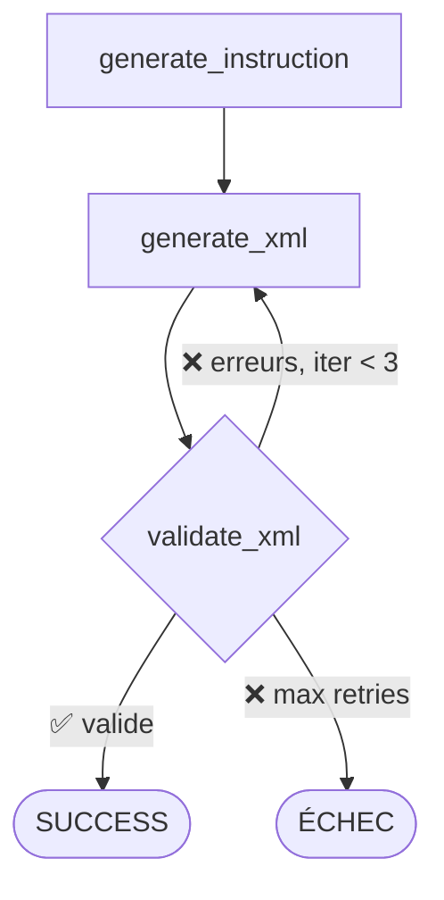
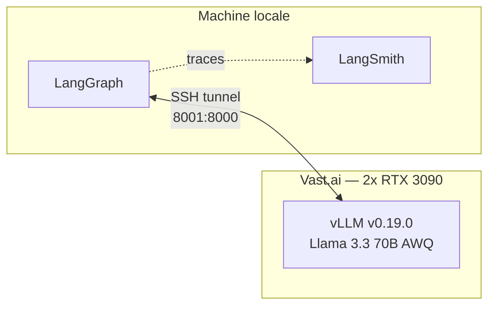

# Génération de Dataset par LLM Proxy — Pipeline LangGraph

## 1. Contexte : le problème du Cold Start

Le projet NAV4RAIL vise à fine-tuner un LLM (Llama 3.1 8B) capable de générer des **Behavior Trees XML** (format BehaviorTree.CPP) pour un robot d'inspection ferroviaire.

**Problème** : nous ne disposons que d'**un seul Behavior Tree de référence** — le fichier `behavior_tree_example.xml` (173 lignes, 14 subtrees, mission d'inspection avec contrôle). Impossible de fine-tuner un modèle avec un unique exemple.

**Solution** : utiliser un **LLM puissant** (Llama 3.3 70B AWQ INT4) comme **proxy de génération** pour produire synthétiquement 2000 paires `(instruction, xml)` validées, qui serviront ensuite de dataset de fine-tuning pour le modèle cible plus petit.

## 2. Architecture du pipeline

Le pipeline est implémenté comme un **graphe LangGraph** à 3 nœuds avec boucle de self-correction :

### Nœud 1 : `generate_instruction`

Génère une instruction de mission en langage naturel à partir de **11 templates × 10 éléments d'inspection × plages kilométriques** (~12 000+ combinaisons uniques).

Exemples produits :
- *"Navigation simple vers un point kilométrique (km 23)"*
- *"Inspection des ballast entre le km 8 et le km 42"*
- *"Inspection des soudures à la volée entre le km 3 et le km 48, sans contrôle des mesures"*

Un mécanisme de **déduplication** (`seen` set) garantit que chaque mission est unique dans le dataset.

### Nœud 2 : `generate_xml`

Envoie au LLM 70B un prompt structuré composé de :

| Composant | Rôle | Taille |
|---|---|---|
| `SYSTEM_PROMPT` | Règles d'architecture BT (format, structure, conventions) | ~800 tokens |
| `SKILLS_DOC` | Catalogue des 28 skills en 5 familles (préparation, motion, inspection, simulation) | ~400 tokens |
| `FEW_SHOT_EXAMPLE` | Le BT de référence condensé (notre unique exemple) | ~600 tokens |
| `classify_mission()` | Directive explicite des subtrees requis selon le type de mission | ~200 tokens |
| `user_prompt` | L'instruction + consignes spécifiques | ~100 tokens |

**Classification sémantique** (`classify_mission`) — analyse l'instruction en Python et injecte les subtrees attendus :

| Type de mission | Subtrees motion | Skills clés |
|---|---|---|
| **Transport** (types 0-4) | move, deccelerate, reach_and_stop, pass, reach_stop_no_wait | Move, MoveAndStop, SignalAndWaitForOrder |
| **Inspection avec contrôle** (types 0-14) | + move_and_inspect, reach_stop_inspecting, ... | + ManageMeasurements, AnalyseMeasurements, MeasurementsQualityValidated |
| **Inspection sans contrôle** (types 0-14) | + move_and_inspect, reach_stop_inspecting, ... | + ManageMeasurements (SANS AnalyseMeasurements) |
| **Transport simple** (types 0-4 seuls) | Seulement transport | Pas de ManageMeasurements |

En mode **correction** (retry), le prompt inclut le XML précédent tronqué + les erreurs de validation.

### Nœud 3 : `validate_xml`

Deux niveaux de validation en cascade :

**A) Validation structurelle** (`validate_bt.py`) — 3 niveaux :
- **L1 Syntaxique** : XML bien formé, `BTCPP_format="4"`, tags valides, skills reconnues via attribut `ID`
- **L2 Structurel** : Pas de nœuds de contrôle vides, profondeur raisonnable, Fallback ≥ 2 branches
- **L3 Sémantique** : Ordre des skills (LoadMission en premier), Conditions dans Fallback

**B) Validation sémantique** (cohérence mission ↔ XML) :
- Mission d'inspection → doit contenir `ManageMeasurements` et types 10-14
- Inspection avec contrôle → doit contenir `AnalyseMeasurements`
- Transport simple → ne doit PAS contenir `ManageMeasurements`

**Score** : 1.0 (parfait) → 0.5-0.9 (warnings) → 0.0 (invalide)

## 3. Infrastructure

- **Serveur** : vLLM avec `--enforce-eager --tensor-parallel-size 2 --quantization awq`
- **Client** : `langchain-openai` via API compatible OpenAI (`/v1/chat/completions`)
- **Tracing** : LangSmith (projet `nav4rail-dataset`) pour le monitoring en temps réel
- **Robustesse** : retry réseau (5 tentatives, backoff 30-150s), `--resume` pour reprise après crash

## 4. Du BT unique au dataset

Le seul BT de référence est exploité de 3 manières :

1. **Few-shot example** dans le prompt — le LLM voit la structure attendue
2. **Catalogue de skills** extrait du BT — les 28 skills avec leurs ports
3. **Règles d'architecture** codifiées dans le system prompt — patterns observés dans le BT de référence (preparation → calculate_path → execute → motion_selector)

Le LLM 70B **généralise** à partir de cet unique exemple pour produire des variantes :
- BTs de transport (9 subtrees, types 0-4 seulement)
- BTs d'inspection avec contrôle (14 subtrees, types 0-14, avec boucle corrective)
- BTs d'inspection sans contrôle (14 subtrees, types 0-14, sans analyse)

La validation garantit que chaque BT généré est **structurellement et sémantiquement correct** avant inclusion dans le dataset.

## 5. Résultats observés

| Métrique | Valeur |
|---|---|
| Taux de validation 1er essai | ~100% (score 1.0) |
| Itérations moyennes | 1.0 |
| Débit | ~115 samples/h |
| Temps estimé pour 2000 samples | ~17h |
| Coût Vast.ai (2x 3090) | ~$6-7 |
| Missions uniques | 100% (déduplication active) |

## 6. Fichiers

| Fichier | Rôle |
|---|---|
| `generate_dataset_llm.py` | Pipeline LangGraph complet |
| `validate_bt.py` | Validateur multi-niveaux BehaviorTree.CPP |
| `behavior_tree_example.xml` | L'unique BT de référence (cold start) |
| `dataset_nav4rail_llm_2000.jsonl` | Dataset de sortie (paires mission/XML) |
| `SKILLS_CATALOG.md` | Documentation des 28 skills |
