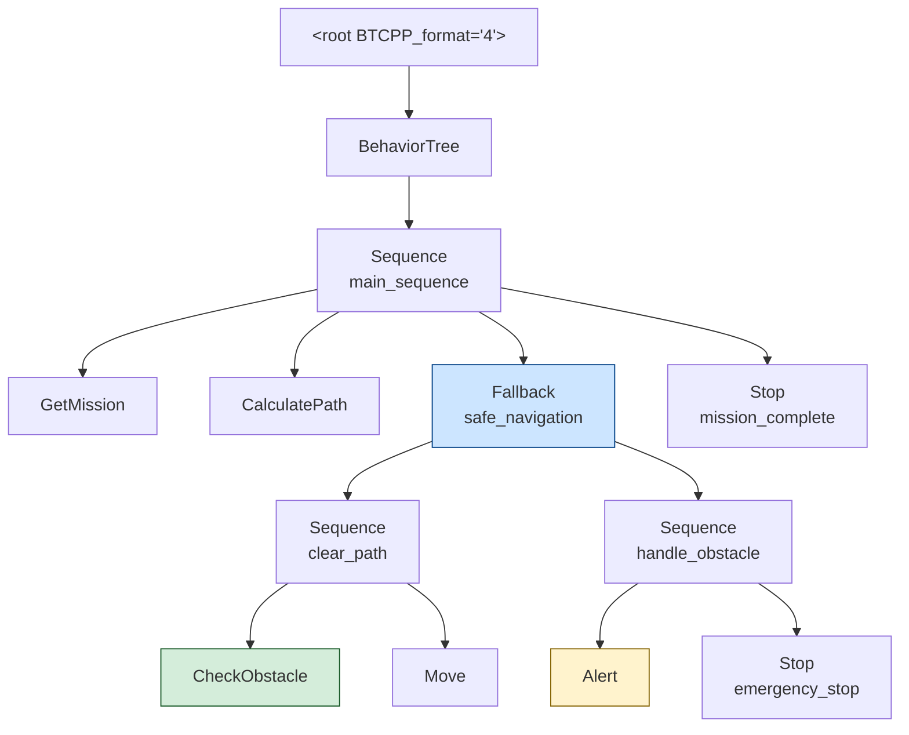
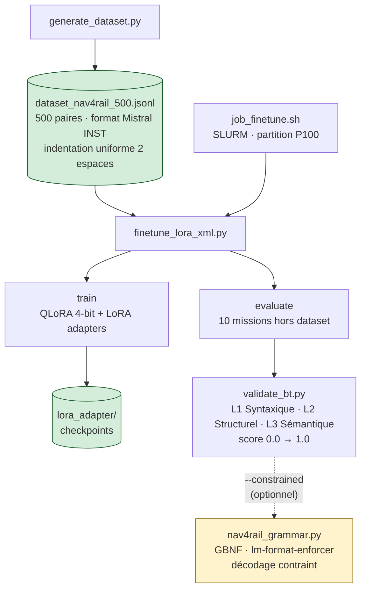
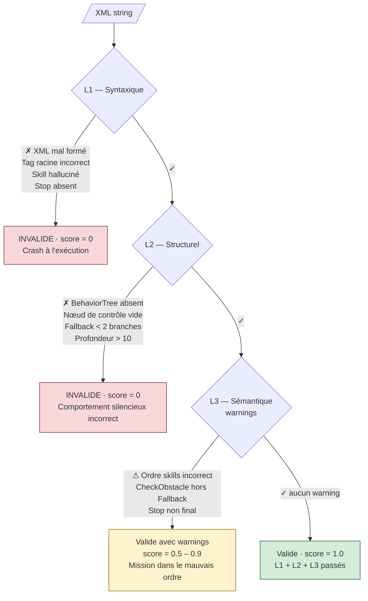
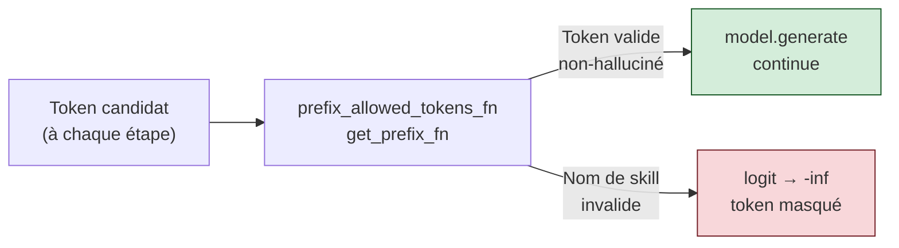

# NAV4RAIL — Fine-Tuning LLM pour Behavior Trees XML

Pipeline de fine-tuning QLoRA pour apprendre à un LLM à traduire une mission
en langage naturel vers un Behavior Tree au format XML BehaviorTree.CPP v4.

---

## Sommaire

- [Contexte du projet](#contexte-du-projet)
- [Architecture du pipeline](#architecture-du-pipeline)
- [Scripts](#scripts)
  - [generate\_dataset.py](#generate_datasetpy)
  - [finetune\_lora\_xml.py](#finetune_lora_xmlpy)
  - [validate\_bt.py](#validate_btpy)
  - [nav4rail\_grammar.py](#nav4rail_grammarpy)
  - [job\_finetune.sh](#job_finetunesh-slurm)
- [Lancement rapide](#lancement-rapide)
- [Choix technologiques — Synthèse](#choix-technologiques--synthèse)

---

## Contexte du projet

NAV4RAIL est un robot de maintenance ferroviaire (SNCF / IAM4RAIL). Il exécute
ses missions sous la forme de **Behavior Trees (BT)** — des arbres de décision
qui séquencent des actions atomiques appelées **skills**. L'objectif est de
permettre à un opérateur de décrire une mission en langage naturel et d'obtenir
automatiquement le BT XML correspondant.

Exemple — *"Navigue en mode sécurisé vers le secteur nord"* :



**Catalogue des skills disponibles :**

| Skill               | Rôle                                                    |
| ------------------- | ------------------------------------------------------- |
| `GetMission`        | Récupère et valide les paramètres de mission            |
| `CalculatePath`     | Calcule le chemin optimal vers la destination           |
| `Move`              | Déplace le robot le long de la voie                     |
| `Decelerate`        | Décélération progressive                                |
| `ManageMeasurement` | Effectue des mesures (géométrie, alignement, thermique) |
| `CheckObstacle`     | Vérifie la voie — retourne SUCCESS si libre             |
| `Alert`             | Envoie une alerte ou un rapport                         |
| `Stop`              | Arrêt complet et sécurisé                               |

---

## Architecture du pipeline



---

## Scripts

### generate_dataset.py

Génère le dataset synthétique de paires `(mission en NL, BT XML)`.

**Pourquoi un dataset synthétique ?**
Les Behavior Trees réels de terrain SNCF ne sont pas encore disponibles.
On crée un *proxy* qui respecte les contraintes structurelles du système réel :
même catalogue de skills, mêmes patterns de contrôle (`Sequence`, `Fallback`),
même format BehaviorTree.CPP v4.

**Pourquoi 5 catégories ?**
Pour couvrir tous les patterns structurels que le modèle doit apprendre :

| Catégorie | Nb | Pattern BT clé |
| --------- | --- | -------------- |
| Navigation simple | 100 | `Sequence` plate (GetMission → Move → Stop) |
| Inspection de voie | 125 | `Sequence` avec `ManageMeasurement` répété |
| Mesures géométriques | 100 | `Sequence` centrée sur les mesures |
| Navigation sécurisée | 75 | `Fallback` (CheckObstacle → Move / Alert → Stop) |
| Missions complexes | 100 | Imbrication + `Alert` + retour dépôt |

**Pourquoi le pattern XML builder (`N()`, `S()`, `F()`, `render()`) ?**
La version initiale construisait le XML à la main avec des f-strings et
`textwrap.dedent`. Résultat : indentation inconsistante selon les exemples,
ce qui perturbait l'apprentissage (le modèle mémorisait une mauvaise indentation).

Le builder récursif `render(node, depth)` garantit une **indentation uniforme
à 2 espaces** quel que soit le niveau d'imbrication :

```python
def render(node: dict, depth: int = 0) -> str:
    pad = "  " * depth
    children = node.get("children")
    if not children:
        return f"{pad}<{node['tag']} name=\"{node['name']}\"/>"
    lines = [f"{pad}<{node['tag']} name=\"{node['name']}\">"]
    for child in children:
        lines.append(render(child, depth + 1))
    lines.append(f"{pad}</{node['tag']}>")
    return "\n".join(lines)
```

---

### finetune_lora_xml.py

Script principal d'entraînement et d'inférence.

```bash
python finetune_lora_xml.py --model mistral              # entraînement
python finetune_lora_xml.py --model mistral --eval-only  # inférence seule
python finetune_lora_xml.py --model mistral --eval-only --constrained  # + GBNF
```

#### Choix du format de données : instruction Mistral

```text
<s>[INST] {system_prompt}
{skills_doc}
Mission : {texte} [/INST] {XML BT} </s>
```

Ce format est celui natif de Mistral-7B-Instruct. Le modèle a été
pré-entraîné à suivre des instructions dans ce format — le fine-tuning
l'adapte à notre domaine sans casser cette capacité.

#### Choix de QLoRA (4-bit + LoRA)

Le fine-tuning classique d'un modèle 7B nécessite ~56 GB de VRAM
(poids fp32 + gradients + optimiseur). Sur P100 (16 GB), c'est impossible.
QLoRA résout le problème en deux étapes :

1. **Quantification 4-bit NF4** : les poids du modèle de base passent de
   ~14 GB à ~4 GB. Ils sont gelés pendant l'entraînement.

2. **Adaptateurs LoRA** : on insère de petites matrices `A × B` dans les
   couches d'attention. Seules ces matrices sont entraînées (~42M params
   pour Mistral, soit 0.58% du total).

```text
Couche d'origine :  W₀ (4-bit, gelé)
Sortie effective :  W₀·x + α/r · B·A·x    (A, B entraînables)
```

#### Pourquoi `DataCollatorForCompletionOnlyLM` ?

Sans ce collateur, le gradient serait calculé sur l'intégralité de la
séquence (instruction + XML). Cela signifie que le modèle apprend aussi
à reproduire le prompt système — ce qui est inutile et dilue le signal.

Avec `response_template = "[/INST]"`, la loss est masquée sur tous les
tokens avant `[/INST]`. Le modèle apprend **uniquement à produire le XML**,
ce qui accélère la convergence (loss eval 0.017 vs ~0.05 sans collateur).

#### Deux modèles : TinyLlama vs Mistral-7B

| Paramètre | TinyLlama | Mistral-7B |
| --------- | --------- | ---------- |
| LoRA rank `r` | 8 | 16 |
| Cibles LoRA | q, k, v, o | q, k, v, o, gate, up, down |
| Batch effectif | 4 × 4 = 16 | 2 × 8 = 16 |
| Learning rate | 3e-4 | 2e-4 |
| Époques | 8 | 5 |

TinyLlama (baseline) : entraînement en ~6 min, utile pour tester le
pipeline ou valider un changement de dataset. Mistral-7B : 25 min,
résultats qualitativement bien supérieurs (voir [RESULTS.md](RESULTS.md)).

#### Extraction XML en post-traitement

Le modèle génère parfois du texte après `</root>` (répétitions, phrases
parasites). On isole le bloc XML valide par :

```python
re.search(r"(<root\b.*?</root>)", raw, re.DOTALL)
```

---

### validate_bt.py

Validateur multi-niveaux. Utilisable en import Python ou en CLI :

```bash
python validate_bt.py mon_bt.xml
echo '<root ...>...</root>' | python validate_bt.py
```

**Pourquoi 3 niveaux et pas juste un parse XML ?**

Un XML syntaxiquement valide n'est pas forcément un BT correct ou exécutable.
Les 3 niveaux filtrent des problèmes de nature différente :



Le **score** (0.0 → 1.0) permet de comparer deux BTs valides syntaxiquement
mais de qualité sémantique différente — ce qu'un simple taux de validité 10/10
ne pouvait pas faire.

---

### nav4rail_grammar.py

Deux mécanismes de contrainte à la génération.

#### 1. GBNF (llama.cpp)

`NAV4RAIL_GBNF` est une grammaire au format BNF reconnu par llama.cpp.
Elle décrit récursivement la structure complète d'un BT NAV4RAIL valide :
`root → sequence | fallback → children → skill | node`.

Usage avec llama.cpp ou llama-cpp-python :

```python
from llama_cpp import Llama, LlamaGrammar
from nav4rail_grammar import NAV4RAIL_GBNF
grammar = LlamaGrammar.from_string(NAV4RAIL_GBNF)
out = llm("...", grammar=grammar)
```

#### 2. lm-format-enforcer (HuggingFace)

`get_prefix_fn(tokenizer)` retourne une `prefix_allowed_tokens_fn` à
passer à `model.generate()`. À chaque étape de décodage, la fonction
calcule quels tokens peuvent prolonger le préfixe courant en restant
compatibles avec la grammaire — les autres sont masqués avec `-inf`.



**Pourquoi le décodage contraint ?**
Même un modèle bien entraîné peut halluciner un nom de skill inexistant
(ex. `<ScanRail/>`, `<Patrol/>`) sous une formulation de mission inhabituelle.
La contrainte grammaticale rend cette hallucination **structurellement
impossible** — quelle que soit la distribution de la mission en entrée.

**Limitation** : un regex ne peut pas vérifier l'équilibrage des balises
(propriété context-sensitive). La contrainte empêche les noms de tags
invalides mais ne garantit pas un XML parfaitement imbriqué. `validate_bt.py`
est toujours appliqué en post-hoc pour cette vérification.

---

### job_finetune.sh (SLURM)

Script SBATCH pour le cluster Telecom Paris (partition P100, 1× Tesla P100-16GB).

**Auto-setup du venv** : le script crée le venv Python si absent et installe
toutes les dépendances. Cela permet de soumettre le job sans étape manuelle
préalable, même sur un nœud qui n'a jamais exécuté ce code.

```bash
MODEL=tinyllama sbatch job_finetune.sh   # baseline rapide (~30 min)
MODEL=mistral   sbatch job_finetune.sh   # modèle principal (~3-4h)
```

**Choix des versions** : les versions de `torch`, `transformers`, `peft`,
`trl` et `bitsandbytes` sont épinglées pour garantir la reproductibilité.
Ces versions ont été validées ensemble sur P100 avec CUDA 12.4.

---

## Lancement rapide

### 1. Générer le dataset

```bash
python generate_dataset.py
# → dataset_nav4rail_500.jsonl (500 exemples, ~2s)
```

### 2. Entraîner sur le cluster

```bash
scp *.py *.sh *.jsonl gpu:~/code/nav4rail_finetune/
ssh gpu
cd ~/code/nav4rail_finetune
MODEL=mistral sbatch job_finetune.sh
```

### 3. Surveiller et récupérer les résultats

```bash
squeue --me
tail -f nav4rail_finetune_<ID>.out
scp -r gpu:~/code/nav4rail_finetune/outputs/ ./outputs/
```

### 4. Inférence et évaluation

```bash
# Évaluation standard (validateur 3 niveaux)
python finetune_lora_xml.py --model mistral --eval-only

# Évaluation avec décodage contraint GBNF
python finetune_lora_xml.py --model mistral --eval-only --constrained

# Valider un BT XML à la main
python validate_bt.py mon_bt.xml
```

---

## Choix technologiques — Synthèse

| Choix | Alternative écartée | Raison |
| ----- | ------------------- | ------ |
| QLoRA 4-bit NF4 | Fine-tuning classique | P100 16 GB — modèle 7B impossible sans quantification |
| Mistral-7B-Instruct | GPT-2, Llama-3 | Pré-entraîné sur le format `[INST]`, meilleur raisonnement structurel |
| Completion-only loss | Loss sur toute la séquence | Gradient concentré sur le XML → convergence 2× plus rapide |
| XML builder récursif | f-strings manuelles | Indentation garantie uniforme → données d'entraînement cohérentes |
| Validateur 3 niveaux | Juste XML parse | Détecte les erreurs sémantiques invisibles au parse simple |
| lm-format-enforcer | outlines, guidance | Intégration directe avec `model.generate()` sans rechargement du modèle |
