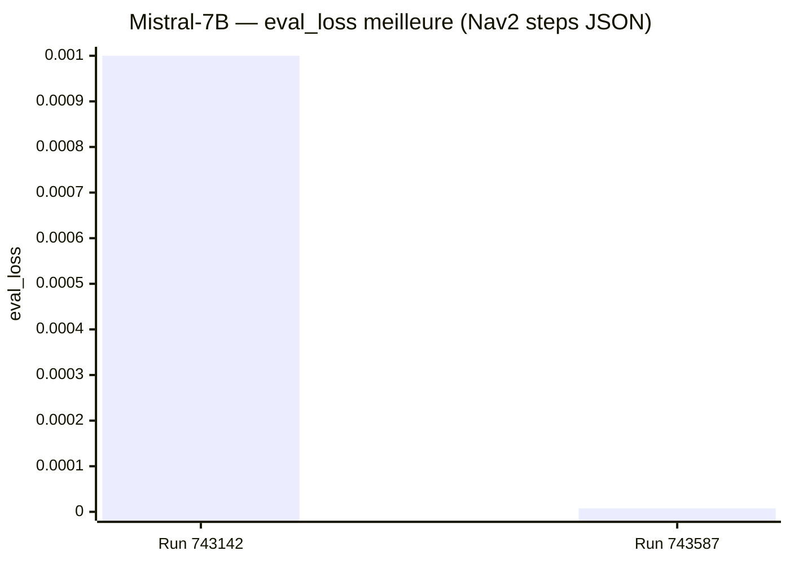

# NAV4RAIL — Résultats Fine-tuning proxy Nav2 (finetune_Nav2)

Ce document synthétise les premiers runs “Nav2 proxy” (mission → steps JSON) effectués sur cluster (RTX 3090) via `finetune_Nav2/`.

## Sommaire

- [Métriques d'entraînement](#métriques-dentraînement)
- [Run 743142 — Mistral-7B (steps JSON)](#run-743142--mistral-7b-steps-json)
  - [Configuration](#configuration)
  - [Ce qui a fonctionné](#ce-qui-a-fonctionné)
  - [Problème principal (loss=0 / eval_loss=nan)](#problème-principal-loss0--eval_lossnan)
  - [Correctif appliqué](#correctif-appliqué)
  - [Recommandations (HF cache / VRAM / torch)](#recommandations-hf-cache--vram--torch)
- [Run 743587 — Mistral-7B (steps JSON)](#run-743587--mistral-7b-steps-json)
  - [Configuration](#configuration-1)
  - [Courbe de loss](#courbe-de-loss)
  - [Ce qui a changé vs 743142](#ce-qui-a-changé-vs-743142)
  - [Artefacts](#artefacts)

---

## Métriques d'entraînement

| Métrique                  | Run 743142 — Mistral-7B | Run 743587 — Mistral-7B |
| ------------------------- | ------------------------ | ------------------------ |
| Modèle                    | `mistralai/Mistral-7B-Instruct-v0.2` | `mistralai/Mistral-7B-Instruct-v0.2` |
| Méthode                   | QLoRA 4-bit NF4 + SFT (TRL) | QLoRA 4-bit NF4 + SFT (TRL) |
| LoRA `r / alpha`          | 16 / 32                  | 16 / 32                  |
| Cibles LoRA               | q,k,v,o,gate,up,down      | q,k,v,o,gate,up,down      |
| Dataset                   | `dataset_nav2_steps.jsonl` | `dataset_nav2_steps.jsonl` |
| Split train / eval        | 1800 / 200               | 1800 / 200               |
| Batch / grad_accum        | 4 / 16                   | 4 / 16                   |
| LR / epochs               | 2e-4 / 10 (prévu)         | 2e-4 / ~10 (9.96)         |
| **Loss train finale**     | 0.0 (symptôme)            | **0.0116** |
| **eval_loss (meilleure)** | NaN (symptôme)            | **7.48e-06** |
| Durée train               | ~3h38 (doc run)            | **13342s (~3h42)** |
| GPU                       | RTX 3090 (24GB)           | RTX 3090 (24GB)           |

---

## Run 743142 — Mistral-7B (steps JSON)

### Configuration

- **Modèle**: `mistralai/Mistral-7B-Instruct-v0.2`
- **Méthode**: QLoRA 4-bit NF4 (`bitsandbytes`) + SFT (`trl.SFTTrainer`)
- **Dataset**: `dataset_out/dataset_nav2_steps.jsonl`
  - split auto: **1800 train / 200 eval** (90/10)
- **GPU**: RTX 3090 (24 GB)
- **Sortie**: `outputs/nav2_steps_mistral7b_lora_743142/lora_adapter/`

Logs de référence :
- `outputs/nav2_finetune_mistral7b_743142.out`
- `outputs/nav2_finetune_mistral7b_743142.err`

### Ce qui a fonctionné

- **Téléchargement HF**: les shards du modèle et les dépendances ont bien été téléchargés et chargés.
- **Exécution training**: la boucle d’entraînement a tourné jusqu’au bout (durée ~3h38 selon `train_runtime`).
- **Sauvegarde adapter**: l’adapter LoRA a été écrit :
  - `outputs/nav2_steps_mistral7b_lora_743142/lora_adapter`

### Problème principal (loss=0 / eval_loss=nan)

Symptômes observés dans `nav2_finetune_mistral7b_743142.out` :
- `train_loss: 0.0`
- `eval_loss: nan` à chaque epoch

Symptômes observés dans `nav2_finetune_mistral7b_743142.err` :
- très nombreux warnings TRL du type :
  - `Could not find response key '### Steps JSON:' ... This instance will be ignored in loss calculation.`

Interprétation :
- Le collator “completion-only” (`DataCollatorForCompletionOnlyLM`) n’a **pas trouvé l’ancre** délimitant la partie “réponse”.
- Résultat: une grande partie (voire la totalité) des exemples est **ignorée** dans le calcul de loss → apprentissage nul (loss=0) et éval incohérente (nan).

Cause probable :
- La tokenisation de l’ancre dépend du contexte (notamment le caractère de début de token SentencePiece).  
  Une ancre `### Steps JSON:` encodée “au début de chaîne” ne matche pas forcément la même séquence de tokens qu’une ancre précédée d’un `\\n`.

### Correctif appliqué

Changements faits dans `finetune_Nav2/` :
- Pour Mistral-7B, ancre collator revenue sur **`[/INST]`** (tokenisation la plus stable sur Mistral).
  - Objectif: éviter les faux négatifs “Could not find response key …” observés sur le cluster.
- `tokenizer.padding_side = "right"` (recommandation TRL pour limiter des effets de padding en fp16).

Action attendue :
- Relancer un run Mistral-7B et vérifier:
  - disparition des warnings “Could not find response key …”
  - `train_loss` non nul et `eval_loss` fini (non-nan)

### Recommandations (HF cache / VRAM / torch)

#### HF cache / téléchargement

Constat du run 743142 :
- `pip install torch==2.3.0` a téléchargé de très gros packages CUDA (cublas/cudnn/…): c’est long et coûteux en stockage.

Recommandations :
- Définir un cache HF stable (disque rapide, évite re-téléchargements) :
  - `HF_HOME=~/.cache/huggingface`
- Si nécessaire, fournir `HUGGINGFACE_HUB_TOKEN` (modèles gated, quotas).

#### VRAM

RTX 3090 (24GB) est adaptée au QLoRA 4-bit + LoRA r=16 sur Mistral-7B.
En cas d’OOM :
- réduire `--batch-size`
- augmenter `--grad-accum`
- réduire `--max-seq-len`

#### Versions torch / CUDA

Le cluster annonce CUDA driver 13.1 (nvidia-smi), mais le torch pip installe des bins + libs CUDA 12.x côté Python.
Recommandation :
- conserver des versions **pinnées** (reproductibilité) et documenter la stratégie d’installation (wheels torch index-url vs meta-packages nvidia).

---

## Run 743587 — Mistral-7B (steps JSON)

### Configuration

- **Modèle**: `mistralai/Mistral-7B-Instruct-v0.2`
- **Méthode**: QLoRA 4-bit NF4 (`bitsandbytes`) + SFT (`trl.SFTTrainer`)
- **Dataset**: `dataset_out/dataset_nav2_steps.jsonl`
  - split auto: **1800 train / 200 eval** (logs `Map: 0/1800` et `0/200` dans `.err`)
- **GPU**: RTX 3090 (24 GB)
- **Sortie**: `outputs/nav2_steps_mistral7b_lora_743587/lora_adapter/`

Logs de référence :
- `outputs/nav2_finetune_mistral7b_743587.out`
- `outputs/nav2_finetune_mistral7b_743587.err`

### Courbe de loss

Extraits (eval par epoch) depuis `nav2_finetune_mistral7b_743587.out` :

- epoch 1.0 : `eval_loss=4.17e-04`
- epoch 1.99 : `eval_loss=2.75e-04`
- epoch 2.99 : `eval_loss=2.98e-05`
- epoch 3.98 : `eval_loss=1.65e-05`
- epoch 4.98 : `eval_loss=1.21e-05`
- epoch 5.97 : `eval_loss=9.98e-06`
- epoch 6.97 : `eval_loss=8.75e-06`
- epoch 8.0 : `eval_loss=8.00e-06`
- epoch 9.0 : `eval_loss=7.60e-06`
- epoch 9.96 : `eval_loss=7.48e-06` (**meilleure**)

Résumé fin de train (mêmes logs) :
- `train_loss=0.0115966`
- `train_runtime=13342s` (~3h42)

### Ce qui a changé vs 743142

- **Plus de warnings TRL “response key”** dans `.err` (recherche “Could not find response key …” = 0 occurrence).
- `eval_loss` est **fini** et décroît sur les epochs → le collator “completion-only” prend correctement en compte les exemples.

À noter :
- la loss “train step” affichée peut apparaître comme `0.0` en fin d’entraînement : cohérent avec une valeur très petite arrondie à l’affichage ; le `train_loss` agrégé reste non nul.
- warnings non bloquants observés dans `.err` : dépréciations `evaluation_strategy`, avertissement `use_reentrant`, etc.

### Artefacts

- Adapter LoRA enregistré :
  - `/home/infres/latoundji-25/code/nav4rail_finetune_nav2/finetune_Nav2/outputs/nav2_steps_mistral7b_lora_743587/lora_adapter`

Prochaine étape recommandée (qualité réelle “mission → steps JSON → XML”) :
- exécuter `python3 -m finetune_Nav2.eval.run_hf_eval ...` sur un set fixe de missions et mesurer :
  - taux de sorties JSON valides
  - taux de BT XML valides (validator strict)
  - erreurs récurrentes (ports manquants, skills hors allowlist, etc.)

