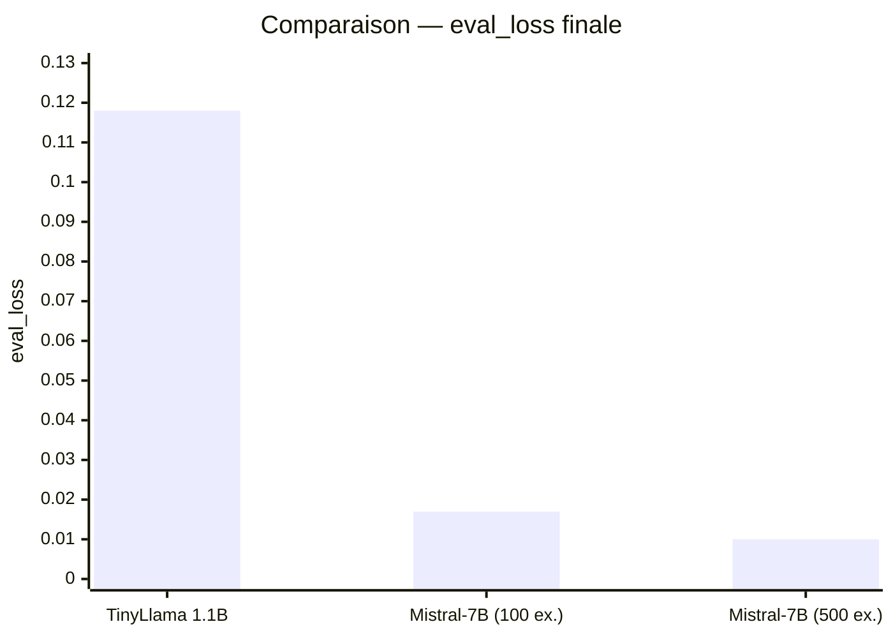
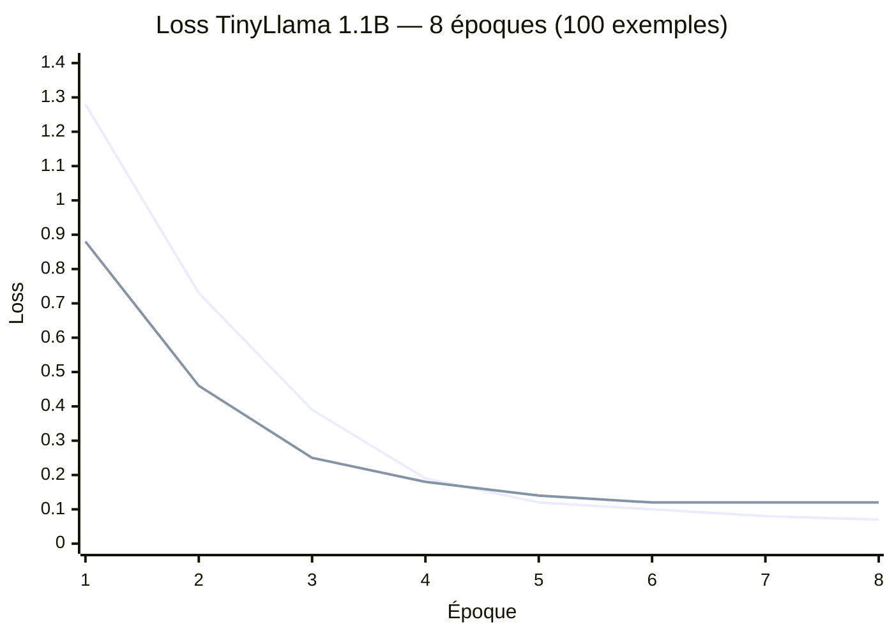
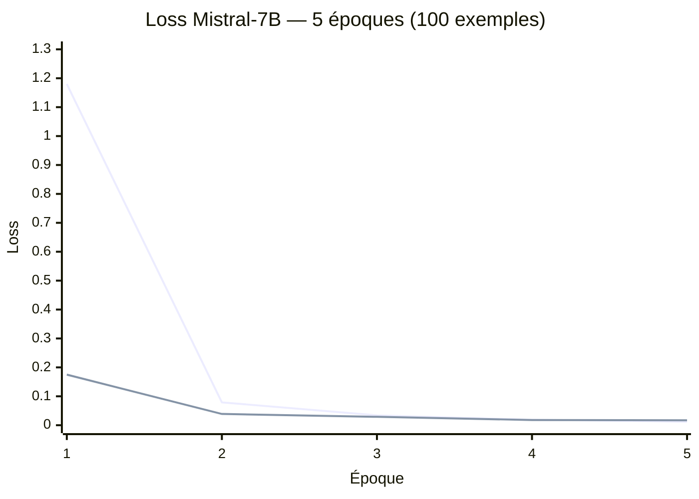
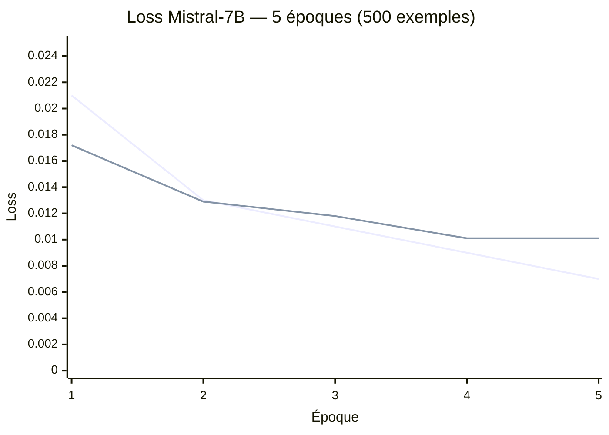
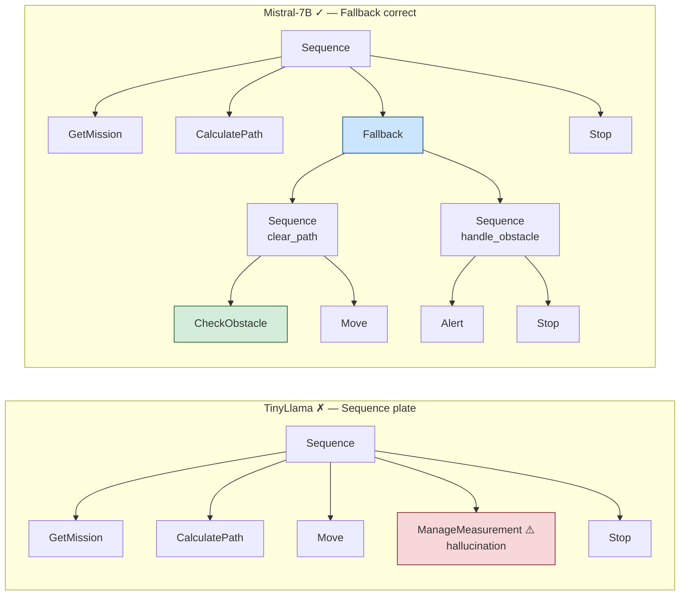
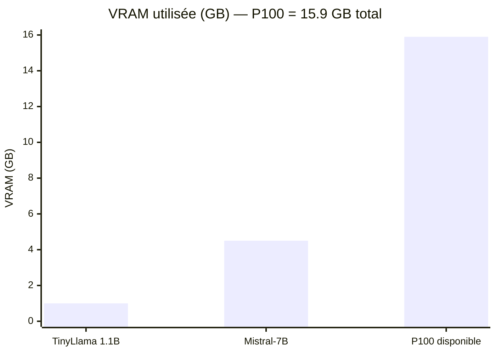

# NAV4RAIL — Résultats Fine-Tuning QLoRA

Résultats des trois runs sur le cluster Telecom Paris (Tesla P100-PCIE-16GB).
TinyLlama 1.1B et Mistral-7B ont été entraînés sur le dataset v1 (100 paires).
Mistral-7B a ensuite été ré-entraîné sur le dataset v2 (500 paires, indentation corrigée).
Méthode commune : QLoRA 4-bit NF4 + `DataCollatorForCompletionOnlyLM`.

---

## Sommaire

- [Métriques d'entraînement](#métriques-dentraînement)
- [TinyLlama 1.1B — Run détaillé](#tinyllama-11b--run-détaillé)
  - [Configuration](#configuration-tinyllama)
  - [Courbe de loss](#courbe-de-loss-tinyllama)
  - [Évaluation syntaxique](#évaluation-syntaxique-tinyllama)
  - [Limites observées](#limites-observées)
- [Mistral-7B — Run détaillé (100 ex.)](#mistral-7b--run-détaillé-100-ex)
  - [Configuration](#configuration-mistral-7b)
  - [Courbe de loss](#courbe-de-loss-mistral-7b)
  - [Évaluation syntaxique](#évaluation-syntaxique-mistral-7b)
- [Mistral-7B — 500 exemples](#mistral-7b--500-exemples)
  - [Configuration](#configuration-mistral-7b-500-ex)
  - [Courbe de loss](#courbe-de-loss-mistral-7b-500-ex)
  - [Évaluation et améliorations](#évaluation-et-améliorations)
- [Comparaison qualitative](#comparaison-qualitative)
  - [Mission 1 — Navigation sécurisée](#mission-1--navigation-sécurisée)
  - [Mission 2 — Navigation post-inspection](#mission-2--navigation-post-inspection)
  - [Mission 3 — Certification après travaux](#mission-3--certification-après-travaux)
- [Synthèse](#synthèse)
- [Recommandations pour la suite](#recommandations-pour-la-suite)

---

## Métriques d'entraînement

| Métrique                   | TinyLlama 1.1B       | Mistral-7B (100 ex.)        | Mistral-7B (500 ex.)        |
| -------------------------- | -------------------- | --------------------------- | --------------------------- |
| Paramètres totaux          | 1.1B                 | 7.3B                        | 7.3B                        |
| Paramètres LoRA entraînés  | 2 252 800 (0.20%)    | 41 943 040 (0.58%)          | 41 943 040 (0.58%)          |
| Rang LoRA `r`              | 8                    | 16                          | 16                          |
| Cibles LoRA                | q, k, v, o           | q, k, v, o, gate, up, down  | q, k, v, o, gate, up, down  |
| Dataset                    | 80 train / 20 eval   | 80 train / 20 eval          | 450 train / 50 eval         |
| VRAM utilisée              | ~1.0 GB / 15.9 GB    | ~4.5 GB / 15.9 GB           | ~4.5 GB / 15.9 GB           |
| Durée d'entraînement       | **6.1 min**          | 25.5 min                    | 139.7 min                   |
| Époques                    | 8 (best à epoch 4)   | 5 (best à epoch 4)          | 5 (best à epoch 4)          |
| Loss train finale          | 0.076                | 0.012                       | 0.007                       |
| **Loss eval finale**       | 0.118                | 0.017                       | **0.010**                   |
| Score syntaxique (L1)      | 10/10 (100%)         | 10/10 (100%)                | 10/10 (100%)                |
| Score sémantique L3 moyen  | n/a                  | n/a                         | **0.97 / 1.0**              |



---

## TinyLlama 1.1B — Run détaillé

### Configuration (TinyLlama)

```python
LoraConfig(
    r=8,
    lora_alpha=16,              # scaling = alpha/r = 2
    target_modules=["q_proj", "k_proj", "v_proj", "o_proj"],
    lora_dropout=0.05,
    task_type=TaskType.CAUSAL_LM,
)

TrainingArguments(
    per_device_train_batch_size=4,
    gradient_accumulation_steps=4,   # batch effectif = 16
    learning_rate=3e-4,
    num_train_epochs=8,
    lr_scheduler_type="cosine",
    optim="paged_adamw_8bit",
    fp16=True,
)
```

**Bilan mémoire sur P100 :**

| Élément                       | VRAM                  |
| ----------------------------- | --------------------- |
| Poids modèle (4-bit)          | ~0.5 GB               |
| Activations + batch           | ~0.4 GB               |
| Optimiseur LoRA (8-bit AdamW) | ~10 MB                |
| **Total**                     | **~1.0 GB / 15.9 GB** |

### Courbe de loss (TinyLlama)

> Bleu : train — Orange : eval · Le best checkpoint est sauvegardé à l'epoch 4.



La loss eval se stabilise à ~0.12 dès l'epoch 5. Avec 100 exemples,
le modèle atteint rapidement sa capacité maximale d'absorption.

### Évaluation syntaxique (TinyLlama)

10 missions hors dataset, score de validité **syntaxique** (L1 uniquement) :

| Mission                                  | Résultat | Structure générée                      |
| ---------------------------------------- | -------- | -------------------------------------- |
| Inspecte la voie au km 30                | ✓        | Sequence + ManageMeasurement           |
| Mesure géométrie 3 km depuis km 12       | ✓        | Sequence + 2× ManageMeasurement        |
| Navigue mode sécurisé secteur nord       | ✓        | Sequence plate (pas de Fallback)       |
| Patrouille km 0→5 avec rapport           | ✓        | Sequence multi-points                  |
| Va au dépôt après l'inspection           | ✓        | Sequence (sémantique incorrecte)       |
| Certifie section B après travaux         | ✓        | Sequence + ManageMeasurement           |
| Contrôle complet + alerte km 25          | ✓        | Sequence + ManageMeasurement × 3       |
| Mesure paramètres thermiques km 8-10     | ✓        | Sequence + ManageMeasurement           |
| Inspecte tunnel km 33 + obstacle         | ✓        | Sequence (CheckObstacle absent)        |
| Déplace vers point de chargement         | ✓        | Sequence + Decelerate + Stop           |

#### Score syntaxique : 10/10 (100%)

### Limites observées

**1. Absence de Fallback dans les missions sécurisées**
Le modèle génère une `Sequence` plate même pour *"Navigue en mode sécurisé"*
ou *"Inspecte avec vérification obstacle"*. Il n'a pas appris à déclencher
la structure `Fallback` au bon moment.

*Cause* : TinyLlama (1.1B) a une capacité de raisonnement structurel limitée.
Avec 100 exemples et seulement 2.25M de paramètres LoRA, le signal pour
associer le mot-clé "sécurisé" au pattern `Fallback` est insuffisant.

**2. Hallucinations sémantiques (sur-généralisation)**
*"Va au dépôt après l'inspection"* génère systématiquement des
`ManageMeasurement` — le modèle sur-généralise vers le pattern d'inspection
le plus fréquent dans le dataset (25/100 exemples).

**3. Indentation inconsistante (dataset v1)**
Les deux modèles reproduisent l'indentation non uniforme du dataset v1.
Corrigé en v2 (500 exemples) via le builder XML récursif.

---

## Mistral-7B — Run détaillé (100 ex.)

### Configuration (Mistral-7B)

```python
LoraConfig(
    r=16,
    lora_alpha=32,              # scaling = alpha/r = 2
    target_modules=["q_proj", "k_proj", "v_proj", "o_proj",
                    "gate_proj", "up_proj", "down_proj"],
    lora_dropout=0.05,
    task_type=TaskType.CAUSAL_LM,
)

TrainingArguments(
    per_device_train_batch_size=2,
    gradient_accumulation_steps=8,   # batch effectif = 16
    learning_rate=2e-4,
    num_train_epochs=5,
    lr_scheduler_type="cosine",
    optim="paged_adamw_8bit",
    fp16=True,
)
```

**Bilan mémoire sur P100 :**

| Élément                       | VRAM                  |
| ----------------------------- | --------------------- |
| Poids modèle (4-bit)          | ~3.5 GB               |
| Activations + batch           | ~0.8 GB               |
| Optimiseur LoRA (8-bit AdamW) | ~0.2 GB               |
| **Total**                     | **~4.5 GB / 15.9 GB** |

### Courbe de loss (Mistral-7B)

> Bleu : train — Orange : eval · Le best checkpoint est sauvegardé à l'epoch 4.



Mistral converge **7× plus bas** que TinyLlama en eval_loss (0.017 vs 0.118).
Dès l'epoch 1, il atteint un niveau que TinyLlama n'atteint jamais.

### Évaluation syntaxique (Mistral-7B)

**Score syntaxique : 10/10 (100%)** — identique à TinyLlama.

La différence n'est pas visible sur le score syntaxique seul.
Elle se manifeste dans la **qualité structurelle et sémantique** des BTs
(voir section suivante).

---

## Mistral-7B — 500 exemples

Même configuration QLoRA que le run 100 ex. — seul le dataset change (v2, 500 paires,
indentation uniforme à 2 espaces garantie par le builder XML récursif).

### Configuration (Mistral-7B 500 ex.)

Configuration LoRA identique au run 100 ex. (voir [ci-dessus](#configuration-mistral-7b)).
Bilan mémoire identique (~4.5 GB / 15.9 GB).

| Différence                  | 100 ex.         | 500 ex.           |
| --------------------------- | --------------- | ----------------- |
| Exemples entraînement       | 80              | 450               |
| Exemples évaluation         | 20              | 50                |
| Durée                       | 25.5 min        | **139.7 min**     |
| Loss eval minimale          | 0.017           | **0.010**         |

### Courbe de loss (Mistral-7B 500 ex.)

> Bleu : train — Orange : eval · Le best checkpoint est sauvegardé à l'epoch 4.



La loss eval descend à **0.010** (vs 0.017 sur 100 ex.), soit un gain de 41 %.
La loss train finale 0.007 reste sous la loss eval — pas de sur-apprentissage.

### Évaluation et améliorations

Évaluation via `validate_bt.py` (L1 + L2 + L3) — job SLURM 738189, adapter du job 738107.

**Résumé :** 10/10 valides · score moyen **0.97 / 1.0** · 3 warnings sémantiques

| Mission                                                      | Score | Warnings         |
| ------------------------------------------------------------ | ----- | ---------------- |
| Inspecte la section de voie au km 30                         | 0.9   | CheckObstacle⁽¹⁾ |
| Mesure la géométrie de la voie sur 3 km depuis le km 12      | 1.0   | —                |
| Navigue en mode sécurisé vers le secteur nord                | 1.0   | —                |
| Effectue une patrouille entre km 0 et km 5 avec rapport      | 1.0   | —                |
| Va au dépôt principal après l'inspection                     | 1.0   | —                |
| Certifie la section B après les travaux de maintenance       | 0.9   | CheckObstacle⁽¹⁾ |
| Contrôle complet avec alerte si défaut détecté au km 25      | 1.0   | —                |
| Mesure les paramètres thermiques entre km 8 et km 10         | 1.0   | —                |
| Inspecte le tunnel au km 33 avec vérification obstacle       | 0.9   | CheckObstacle⁽¹⁾ |
| Déplace-toi vers le point de chargement et attends           | 1.0   | —                |

**(1)** `<CheckObstacle>` présent hors de tout `<Fallback>` — le signal FAILURE ne sera pas
intercepté par un chemin de récupération. Le modèle place correctement CheckObstacle dans
les contextes de sécurité explicite (`Fallback` pour "mode sécurisé"), mais l'utilise comme
vérification préliminaire directe dans les contextes d'inspection — sémantiquement discutable
mais structurellement valide.

**Gains vs Mistral-7B 100 ex. :**

- Navigation pure (`Va au dépôt`) : aucune hallucination `ManageMeasurement` — score 1.0
- Géométrie multi-points : pattern `Move → ManageMeasurement → Move` systématique — score 1.0
- Fallback pour "mode sécurisé" : maintenu et renforcé — score 1.0
- Indentation uniforme à 2 espaces sur tous les BTs générés

**Warning récurrent (3/10) :**
CheckObstacle utilisé hors Fallback dans les missions d'inspection — cas non couvert
par le dataset v2 (les 75 exemples "navigation sécurisée" enseignent Fallback, mais pas
les 125 exemples "inspection" qui n'utilisent pas CheckObstacle + Fallback combinés).

---

## Comparaison qualitative

### Mission 1 — Navigation sécurisée

**Prompt :** *"Navigue en mode sécurisé vers le secteur nord"*

| Critère                        | TinyLlama          | Mistral-7B              |
| ------------------------------ | ------------------ | ----------------------- |
| Structure                      | Sequence plate     | Fallback ✓              |
| CheckObstacle                  | Absent ✗           | Présent ✓               |
| Alert si bloqué                | Absent ✗           | Présent ✓               |
| Interprétation de "sécurisé"   | ✗ Ignoré           | ✓ Traduit en Fallback   |



---

### Mission 2 — Navigation post-inspection

**Prompt :** *"Va au dépôt principal après l'inspection"*

| Critère        | TinyLlama                     | Mistral-7B          |
| -------------- | ----------------------------- | ------------------- |
| Skills ajoutés | 3× ManageMeasurement ✗        | Decelerate ✓        |
| Sémantique     | ✗ Génère des mesures fantômes | ✓ Navigation propre |

```xml
<!-- TinyLlama — sur-généralise vers le pattern "inspection" -->
<Sequence name="main_sequence">
  <GetMission name="get_mission"/>
  <CalculatePath name="calculate_path"/>
  <Move name="move_to_zone"/>
  <ManageMeasurement name="measure_1"/>    <!-- non demandé -->
  <ManageMeasurement name="measure_2"/>    <!-- non demandé -->
  <ManageMeasurement name="measure_3"/>    <!-- non demandé -->
  <Stop name="stop"/>
</Sequence>

<!-- Mistral-7B — BT de retour au dépôt minimal et correct -->
<Sequence name="navigation_sequence">
  <GetMission name="get_mission"/>
  <CalculatePath name="calculate_path"/>
  <Move name="move_to_target"/>
  <Decelerate name="decelerate"/>
  <Stop name="stop"/>
</Sequence>
```

---

### Mission 3 — Certification après travaux

**Prompt :** *"Certifie la section B après les travaux de maintenance"*

| Critère             | TinyLlama              | Mistral-7B                           |
| ------------------- | ---------------------- | ------------------------------------ |
| CheckObstacle       | Absent ✗               | Présent ✓                            |
| Nombre de mesures   | 1                      | 3 (before / after / confirm) ✓       |
| Alert certification | Absent ✗               | Présent ✓                            |
| Sémantique          | ✗ Inspection générique | ✓ Séquence de certification complète |

```xml
<!-- TinyLlama — inspection générique, pas de certification -->
<Sequence name="inspection_sequence">
  <GetMission name="get_mission"/>
  <CalculatePath name="calculate_path"/>
  <Move name="move_to_zone"/>
  <ManageMeasurement name="measure_zone"/>
  <Stop name="stop"/>
</Sequence>

<!-- Mistral-7B — certification avec 3 mesures et rapport -->
<Sequence name="certification_sequence">
  <GetMission name="get_mission"/>
  <CalculatePath name="calculate_path"/>
  <Move name="move_to_zone"/>
  <CheckObstacle name="verify_safety"/>
  <ManageMeasurement name="measure_before"/>
  <ManageMeasurement name="measure_after"/>
  <ManageMeasurement name="measure_confirm"/>
  <Alert name="certify_section"/>
  <Stop name="stop"/>
</Sequence>
```

---

## Synthèse



| Critère                                    | TinyLlama 1.1B      | Mistral-7B (100 ex.)           | Mistral-7B (500 ex.)              |
| ------------------------------------------ | ------------------- | ------------------------------ | --------------------------------- |
| Validité syntaxique (L1)                   | 10/10 ✓             | 10/10 ✓                        | 10/10 ✓                           |
| Loss eval                                  | 0.118               | 0.017 (7× mieux)               | **0.010** (12× mieux)             |
| Score sémantique L3 moyen                  | n/a                 | n/a                            | **0.97 / 1.0**                    |
| Fallback si "sécurisé"                     | ✗ Jamais            | ✓ Systématique                 | ✓ Systématique                    |
| CheckObstacle contextuel                   | ✗ Absent            | ✓ Présent                      | ✓ Présent (3 warnings hors FB)    |
| Hallucinations (ManageMeasurement fantôme) | ✗ Fréquentes        | ✓ Absentes                     | ✓ Absentes                        |
| Précision sémantique                       | ✗ Sur-généralise    | ✓ Respecte l'intention         | ✓ Très précis                     |
| Pattern multi-points                       | ✗ Absent            | ✗ ManageMeasurement isolé      | ✓ Move → MM → Move                |
| Indentation XML                            | ✗ Inconsistante     | ✗ Inconsistante (dataset v1)   | ✓ Uniforme 2 espaces              |
| Durée d'entraînement                       | **6 min**           | 25.5 min                       | 139.7 min                         |
| VRAM                                       | **1.0 GB**          | 4.5 GB                         | 4.5 GB                            |

**Pourquoi Mistral 500 ex. est le meilleur modèle :**
La loss eval 0.010 (−41 % vs 100 ex.) et le score sémantique 0.97 confirment que
le volume de données est le principal levier d'amélioration sur ce type de tâche.
Les 3 warnings restants (CheckObstacle hors Fallback dans des contextes d'inspection)
indiquent la prochaine limite à traiter : le dataset v2 ne couvre pas le pattern
"inspection sécurisée" (CheckObstacle + Fallback combinés hors navigation).

---

## Recommandations pour la suite

| Action                                                          | Statut       | Impact attendu / observé                                          |
| --------------------------------------------------------------- | ------------ | ----------------------------------------------------------------- |
| Dataset 500 ex. (v2) + indentation corrigée                     | ✅ Réalisé   | Indentation uniforme, hallucinations éliminées                    |
| Mistral-7B sur 500 ex.                                          | ✅ Réalisé   | Loss eval 0.010, score L3 0.97/1.0                                |
| Validation sémantique L3 (`validate_bt.py`)                     | ✅ Réalisé   | Discrimine TinyLlama / Mistral 100 ex. / Mistral 500 ex.          |
| Décodage contraint GBNF (`--constrained`)                       | ✅ Implémenté| Zéro hallucination de nom de skill garantie structurellement      |
| Ajouter pattern "inspection sécurisée" dans le dataset          | À faire      | Corriger les 3 warnings CheckObstacle hors Fallback               |
| Augmenter les époques (5 → 8)                                   | À faire      | Loss eval potentiellement < 0.008                                 |
| Évaluation `--constrained` sur l'adapter 738107                 | À faire      | Mesurer l'impact du décodage GBNF sur le score L3                 |
| Intégrer BTs réels SNCF dès réception                           | À faire      | Remplacement progressif du proxy synthétique                      |
