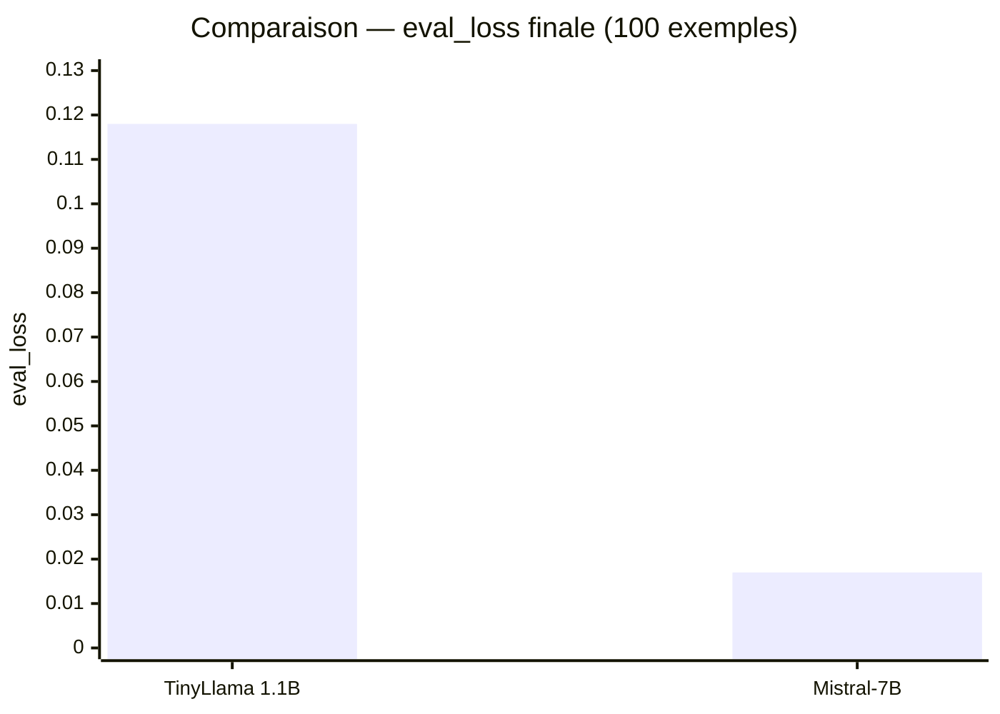
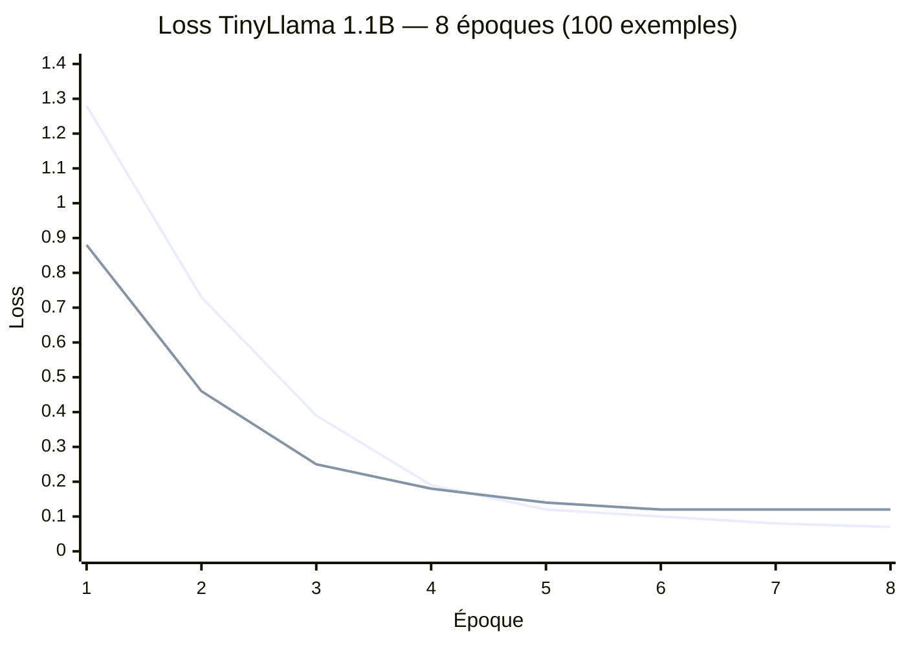
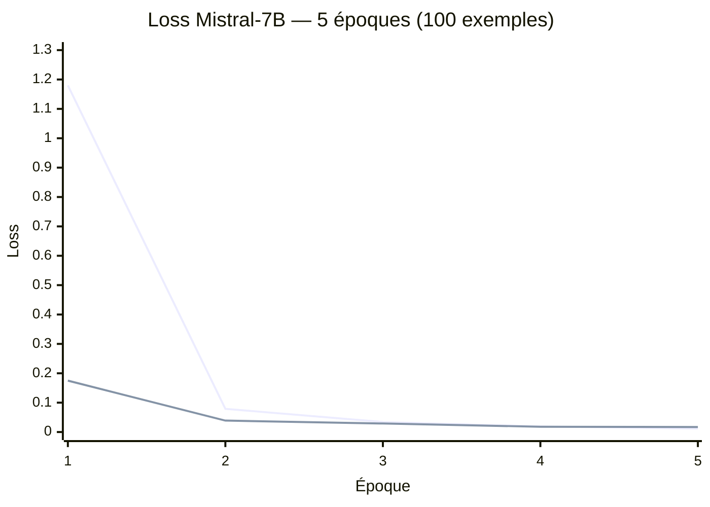
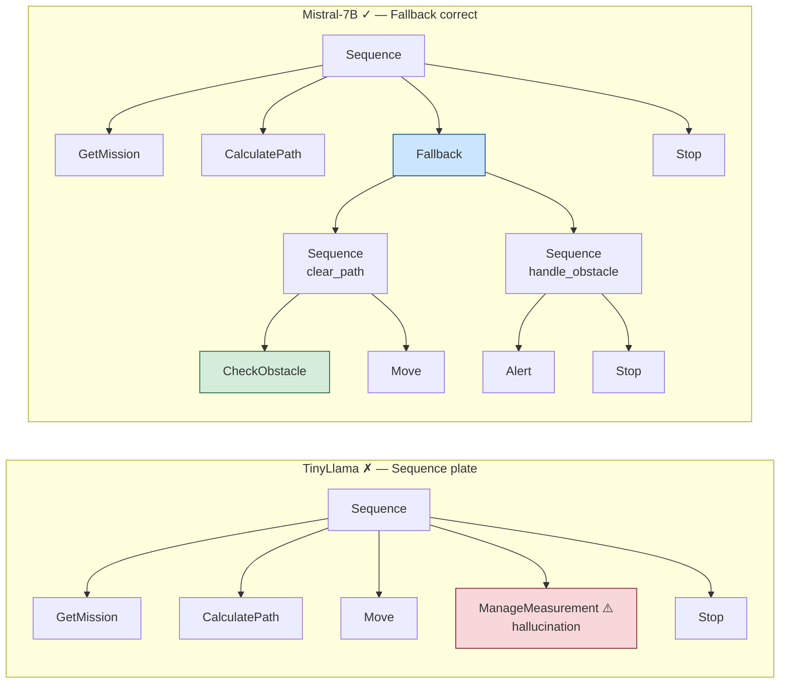
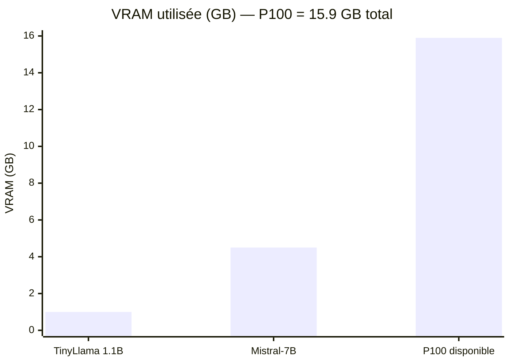

# NAV4RAIL — Résultats Fine-Tuning QLoRA

Résultats des deux runs sur le cluster Telecom Paris (Tesla P100-PCIE-16GB).
Dataset commun : 100 paires synthétiques (proxy NAV4RAIL, v1).
Méthode commune : QLoRA 4-bit NF4 + `DataCollatorForCompletionOnlyLM`.

---

## Sommaire

- [Métriques d'entraînement](#métriques-dentraînement)
- [TinyLlama 1.1B — Run détaillé](#tinyllama-11b--run-détaillé)
  - [Configuration](#configuration-tinyllama)
  - [Courbe de loss](#courbe-de-loss-tinyllama)
  - [Évaluation syntaxique](#évaluation-syntaxique-tinyllama)
  - [Limites observées](#limites-observées)
- [Mistral-7B — Run détaillé](#mistral-7b--run-détaillé)
  - [Configuration](#configuration-mistral-7b)
  - [Courbe de loss](#courbe-de-loss-mistral-7b)
  - [Évaluation syntaxique](#évaluation-syntaxique-mistral-7b)
- [Comparaison qualitative](#comparaison-qualitative)
  - [Mission 1 — Navigation sécurisée](#mission-1--navigation-sécurisée)
  - [Mission 2 — Navigation post-inspection](#mission-2--navigation-post-inspection)
  - [Mission 3 — Certification après travaux](#mission-3--certification-après-travaux)
- [Synthèse](#synthèse)
- [Recommandations pour la suite](#recommandations-pour-la-suite)

---

## Métriques d'entraînement

| Métrique                   | TinyLlama 1.1B        | Mistral-7B                  |
| -------------------------- | --------------------- | --------------------------- |
| Paramètres totaux          | 1.1B                  | 7.3B                        |
| Paramètres LoRA entraînés  | 2 252 800 (0.20%)     | 41 943 040 (0.58%)          |
| Rang LoRA `r`              | 8                     | 16                          |
| Cibles LoRA                | q, k, v, o            | q, k, v, o, gate, up, down  |
| VRAM utilisée              | ~1.0 GB / 15.9 GB     | ~4.5 GB / 15.9 GB           |
| Durée d'entraînement       | **6.1 min**           | 25.5 min                    |
| Époques                    | 8 (best à epoch 4)    | 5 (best à epoch 4)          |
| Loss train finale          | 0.076                 | 0.012                       |
| **Loss eval finale**       | 0.118                 | **0.017**                   |
| Score syntaxique           | 10/10 (100%)          | 10/10 (100%)                |



---

## TinyLlama 1.1B — Run détaillé

### Configuration (TinyLlama)

```python
LoraConfig(
    r=8,
    lora_alpha=16,              # scaling = alpha/r = 2
    target_modules=["q_proj", "k_proj", "v_proj", "o_proj"],
    lora_dropout=0.05,
    task_type=TaskType.CAUSAL_LM,
)

TrainingArguments(
    per_device_train_batch_size=4,
    gradient_accumulation_steps=4,   # batch effectif = 16
    learning_rate=3e-4,
    num_train_epochs=8,
    lr_scheduler_type="cosine",
    optim="paged_adamw_8bit",
    fp16=True,
)
```

**Bilan mémoire sur P100 :**

| Élément                       | VRAM                  |
| ----------------------------- | --------------------- |
| Poids modèle (4-bit)          | ~0.5 GB               |
| Activations + batch           | ~0.4 GB               |
| Optimiseur LoRA (8-bit AdamW) | ~10 MB                |
| **Total**                     | **~1.0 GB / 15.9 GB** |

### Courbe de loss (TinyLlama)

> Bleu : train — Orange : eval · Le best checkpoint est sauvegardé à l'epoch 4.



La loss eval se stabilise à ~0.12 dès l'epoch 5. Avec 100 exemples,
le modèle atteint rapidement sa capacité maximale d'absorption.

### Évaluation syntaxique (TinyLlama)

10 missions hors dataset, score de validité **syntaxique** (L1 uniquement) :

| Mission                                  | Résultat | Structure générée                      |
| ---------------------------------------- | -------- | -------------------------------------- |
| Inspecte la voie au km 30                | ✓        | Sequence + ManageMeasurement           |
| Mesure géométrie 3 km depuis km 12       | ✓        | Sequence + 2× ManageMeasurement        |
| Navigue mode sécurisé secteur nord       | ✓        | Sequence plate (pas de Fallback)       |
| Patrouille km 0→5 avec rapport           | ✓        | Sequence multi-points                  |
| Va au dépôt après l'inspection           | ✓        | Sequence (sémantique incorrecte)       |
| Certifie section B après travaux         | ✓        | Sequence + ManageMeasurement           |
| Contrôle complet + alerte km 25          | ✓        | Sequence + ManageMeasurement × 3       |
| Mesure paramètres thermiques km 8-10     | ✓        | Sequence + ManageMeasurement           |
| Inspecte tunnel km 33 + obstacle         | ✓        | Sequence (CheckObstacle absent)        |
| Déplace vers point de chargement         | ✓        | Sequence + Decelerate + Stop           |

#### Score syntaxique : 10/10 (100%)

### Limites observées

**1. Absence de Fallback dans les missions sécurisées**
Le modèle génère une `Sequence` plate même pour *"Navigue en mode sécurisé"*
ou *"Inspecte avec vérification obstacle"*. Il n'a pas appris à déclencher
la structure `Fallback` au bon moment.

*Cause* : TinyLlama (1.1B) a une capacité de raisonnement structurel limitée.
Avec 100 exemples et seulement 2.25M de paramètres LoRA, le signal pour
associer le mot-clé "sécurisé" au pattern `Fallback` est insuffisant.

**2. Hallucinations sémantiques (sur-généralisation)**
*"Va au dépôt après l'inspection"* génère systématiquement des
`ManageMeasurement` — le modèle sur-généralise vers le pattern d'inspection
le plus fréquent dans le dataset (25/100 exemples).

**3. Indentation inconsistante (dataset v1)**
Les deux modèles reproduisent l'indentation non uniforme du dataset v1.
Corrigé en v2 (500 exemples) via le builder XML récursif.

---

## Mistral-7B — Run détaillé

### Configuration (Mistral-7B)

```python
LoraConfig(
    r=16,
    lora_alpha=32,              # scaling = alpha/r = 2
    target_modules=["q_proj", "k_proj", "v_proj", "o_proj",
                    "gate_proj", "up_proj", "down_proj"],
    lora_dropout=0.05,
    task_type=TaskType.CAUSAL_LM,
)

TrainingArguments(
    per_device_train_batch_size=2,
    gradient_accumulation_steps=8,   # batch effectif = 16
    learning_rate=2e-4,
    num_train_epochs=5,
    lr_scheduler_type="cosine",
    optim="paged_adamw_8bit",
    fp16=True,
)
```

**Bilan mémoire sur P100 :**

| Élément                       | VRAM                  |
| ----------------------------- | --------------------- |
| Poids modèle (4-bit)          | ~3.5 GB               |
| Activations + batch           | ~0.8 GB               |
| Optimiseur LoRA (8-bit AdamW) | ~0.2 GB               |
| **Total**                     | **~4.5 GB / 15.9 GB** |

### Courbe de loss (Mistral-7B)

> Bleu : train — Orange : eval · Le best checkpoint est sauvegardé à l'epoch 4.



Mistral converge **7× plus bas** que TinyLlama en eval_loss (0.017 vs 0.118).
Dès l'epoch 1, il atteint un niveau que TinyLlama n'atteint jamais.

### Évaluation syntaxique (Mistral-7B)

**Score syntaxique : 10/10 (100%)** — identique à TinyLlama.

La différence n'est pas visible sur le score syntaxique seul.
Elle se manifeste dans la **qualité structurelle et sémantique** des BTs
(voir section suivante).

---

## Comparaison qualitative

### Mission 1 — Navigation sécurisée

**Prompt :** *"Navigue en mode sécurisé vers le secteur nord"*

| Critère                        | TinyLlama          | Mistral-7B              |
| ------------------------------ | ------------------ | ----------------------- |
| Structure                      | Sequence plate     | Fallback ✓              |
| CheckObstacle                  | Absent ✗           | Présent ✓               |
| Alert si bloqué                | Absent ✗           | Présent ✓               |
| Interprétation de "sécurisé"   | ✗ Ignoré           | ✓ Traduit en Fallback   |



---

### Mission 2 — Navigation post-inspection

**Prompt :** *"Va au dépôt principal après l'inspection"*

| Critère        | TinyLlama                     | Mistral-7B          |
| -------------- | ----------------------------- | ------------------- |
| Skills ajoutés | 3× ManageMeasurement ✗        | Decelerate ✓        |
| Sémantique     | ✗ Génère des mesures fantômes | ✓ Navigation propre |

```xml
<!-- TinyLlama — sur-généralise vers le pattern "inspection" -->
<Sequence name="main_sequence">
  <GetMission name="get_mission"/>
  <CalculatePath name="calculate_path"/>
  <Move name="move_to_zone"/>
  <ManageMeasurement name="measure_1"/>    <!-- non demandé -->
  <ManageMeasurement name="measure_2"/>    <!-- non demandé -->
  <ManageMeasurement name="measure_3"/>    <!-- non demandé -->
  <Stop name="stop"/>
</Sequence>

<!-- Mistral-7B — BT de retour au dépôt minimal et correct -->
<Sequence name="navigation_sequence">
  <GetMission name="get_mission"/>
  <CalculatePath name="calculate_path"/>
  <Move name="move_to_target"/>
  <Decelerate name="decelerate"/>
  <Stop name="stop"/>
</Sequence>
```

---

### Mission 3 — Certification après travaux

**Prompt :** *"Certifie la section B après les travaux de maintenance"*

| Critère             | TinyLlama              | Mistral-7B                           |
| ------------------- | ---------------------- | ------------------------------------ |
| CheckObstacle       | Absent ✗               | Présent ✓                            |
| Nombre de mesures   | 1                      | 3 (before / after / confirm) ✓       |
| Alert certification | Absent ✗               | Présent ✓                            |
| Sémantique          | ✗ Inspection générique | ✓ Séquence de certification complète |

```xml
<!-- TinyLlama — inspection générique, pas de certification -->
<Sequence name="inspection_sequence">
  <GetMission name="get_mission"/>
  <CalculatePath name="calculate_path"/>
  <Move name="move_to_zone"/>
  <ManageMeasurement name="measure_zone"/>
  <Stop name="stop"/>
</Sequence>

<!-- Mistral-7B — certification avec 3 mesures et rapport -->
<Sequence name="certification_sequence">
  <GetMission name="get_mission"/>
  <CalculatePath name="calculate_path"/>
  <Move name="move_to_zone"/>
  <CheckObstacle name="verify_safety"/>
  <ManageMeasurement name="measure_before"/>
  <ManageMeasurement name="measure_after"/>
  <ManageMeasurement name="measure_confirm"/>
  <Alert name="certify_section"/>
  <Stop name="stop"/>
</Sequence>
```

---

## Synthèse



| Critère                                   | TinyLlama 1.1B         | Mistral-7B                       |
| ----------------------------------------- | ---------------------- | -------------------------------- |
| Validité syntaxique                       | 10/10 ✓                | 10/10 ✓                          |
| Loss eval                                 | 0.118                  | **0.017** (7× mieux)             |
| Fallback si "sécurisé"                    | ✗ Jamais               | ✓ Systématique                   |
| CheckObstacle contextuel                  | ✗ Absent               | ✓ Présent                        |
| Hallucinations (ManageMeasurement fantôme)| ✗ Fréquentes           | ✓ Absentes                       |
| Précision sémantique                      | ✗ Sur-généralise       | ✓ Respecte l'intention           |
| Richesse structurelle                     | Sequences plates       | Sequences + Fallback imbriqués   |
| Durée d'entraînement                      | **6 min**              | 25.5 min                         |
| VRAM                                      | **1.0 GB**             | 4.5 GB                           |

**Pourquoi Mistral est meilleur structurellement :**
Mistral-7B a été pré-entraîné sur un corpus bien plus large et dispose d'une
capacité de raisonnement supérieure. Avec 41M de paramètres LoRA (vs 2.25M),
il peut associer des **mots-clés sémantiques** ("sécurisé", "certifie") à des
**patterns structurels spécifiques** (Fallback, séquence de 3 mesures, Alert).

TinyLlama, avec sa capacité limitée et seulement 100 exemples, mémorise
le pattern le plus fréquent dans le dataset (Sequence + ManageMeasurement)
et l'applique même quand ce n'est pas pertinent.

---

## Recommandations pour la suite

| Action                                              | Impact attendu                                                |
| --------------------------------------------------- | ------------------------------------------------------------- |
| Dataset 500 ex. (v2) + indentation corrigée         | Indentation uniforme, meilleure généralisation sémantique     |
| Mistral-7B sur 500 ex.                              | Fewer hallucinations, Fallback plus systématique              |
| Augmenter les époques (5 → 8)                       | Loss eval potentiellement < 0.01                              |
| Validation sémantique L3 (`validate_bt.py`)         | Score plus réaliste, discrimine les BTs de qualité différente |
| Décodage contraint GBNF (`--constrained`)           | Zéro hallucination de nom de skill garantie structurellement  |
| Intégrer BTs réels SNCF dès réception               | Remplacement progressif du proxy synthétique                  |
