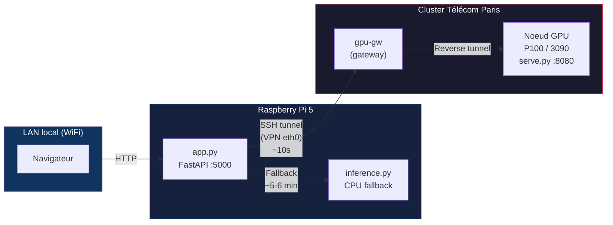
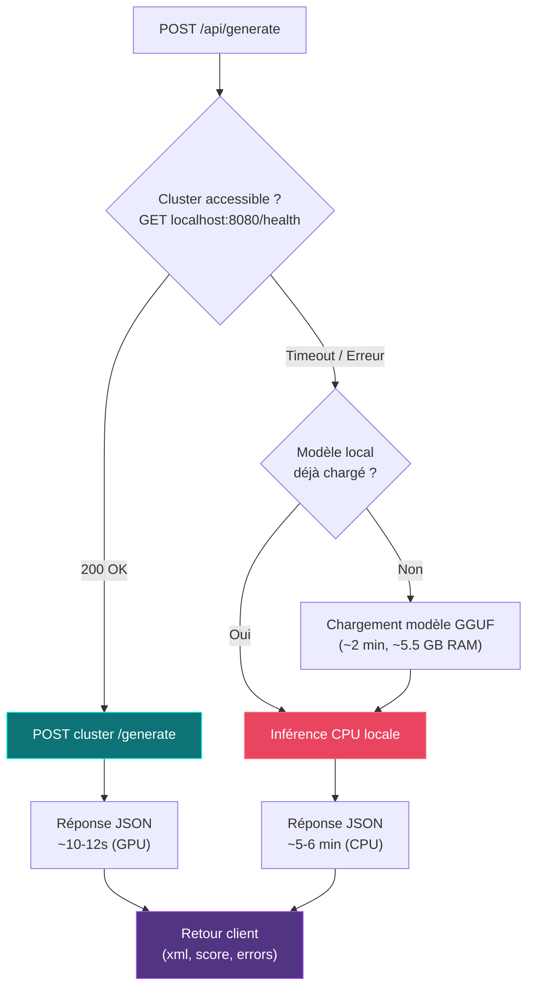
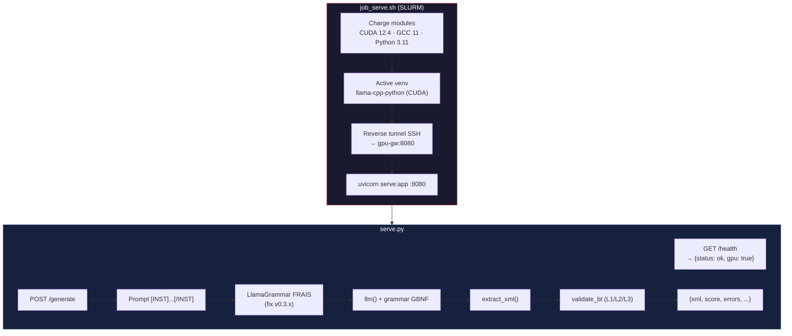
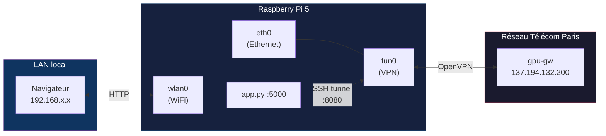
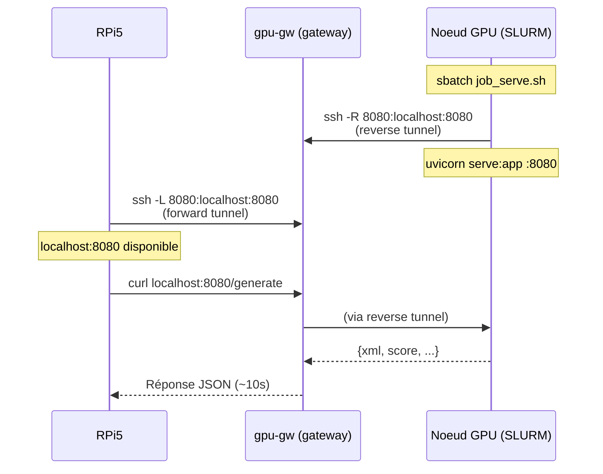
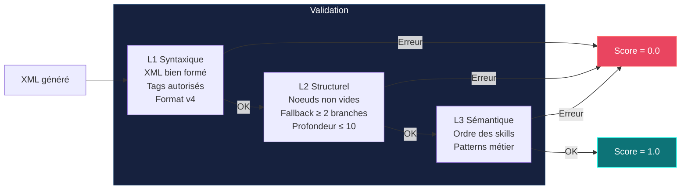

# Architecture d'inférence NAV4RAIL

> Génération de Behavior Trees XML par un modèle Mistral-7B fine-tuné,
> avec inférence GPU sur le cluster Télécom Paris et fallback CPU sur Raspberry Pi 5.

---

## Vue d'ensemble



**Deux backends d'inférence, un seul point d'entrée :**

| Backend | Matériel | Temps d'inférence | Rôle |
|---------|----------|-------------------|------|
| Cluster Télécom Paris | Tesla P100 16 GB | ~10-12 s | **Primaire** |
| RPi5 local | ARM Cortex-A76 (CPU) | ~5-6 min | **Fallback** |

---

## Composants

### 1. Webapp FastAPI (`app.py` — RPi5)

Point d'entrée unique pour le navigateur. Hébergée sur la RPi5, accessible via WiFi sur le LAN local.

**Logique de sélection du backend :**



**Endpoints :**

| Route | Méthode | Description |
|-------|---------|-------------|
| `/` | GET | Interface web (Jinja2) |
| `/api/status` | GET | Backend actif (`cluster` ou `local`) + état du modèle |
| `/api/generate` | POST | Génère un BT XML (routing automatique cluster/local) |
| `/api/validate` | POST | Valide un XML BT existant (sans inférence) |
| `/api/examples` | GET | Liste de missions d'exemple |
| `/api/history/stream` | GET | SSE temps réel (statut génération, historique) |

### 2. Serveur d'inférence GPU (`serve.py` — Cluster)

Service FastAPI minimal déployé via un job SLURM sur un noeud GPU.

**Fichier de job :** [`job_serve.sh`](job_serve.sh)



**Point critique — Grammaire GBNF :**

Avec llama-cpp-python v0.3.x, l'objet `LlamaGrammar` encapsule un `llama_sampler` dont l'état interne n'est **pas réinitialisé** entre les appels. Il faut créer un objet frais par requête :

```python
# ✅ Correct (v0.3.x)
def _make_grammar():
    return LlamaGrammar.from_string(GRAMMAR_STR)

output = llm(prompt, grammar=_make_grammar())
```

```python
# ❌ Bug silencieux (grammaire ignorée)
grammar = LlamaGrammar.from_string(GRAMMAR_STR)
output = llm(prompt, grammar=grammar)  # OK 1ère fois, ignorée ensuite
```

### 3. Moteur d'inférence local (`inference.py` — RPi5)

Classe `Nav4RailGenerator` chargeant le modèle GGUF directement en mémoire CPU sur la RPi5. Activé uniquement si le cluster est inaccessible.

```python
class Nav4RailGenerator:
    def __init__(self, model_path, n_ctx=2048):
        self._llm = Llama(model_path=model_path, n_ctx=n_ctx, verbose=False)
        self._grammar = LlamaGrammar.from_string(NAV4RAIL_GBNF)

    def generate(self, mission, use_grammar=True) -> dict:
        # Prompt [INST] + SYSTEM_PROMPT + SKILLS_DOC + mission
        # → llm() avec grammar GBNF → extract_xml → validate_bt
        ...
```

| Paramètre | Valeur |
|-----------|--------|
| Modèle | `nav4rail-mistral-7b-q4_k_m.gguf` (~4.1 GB, Q4_K_M) |
| Contexte | 2048 tokens |
| Threads | auto (4 cores ARM) |
| RAM | ~5.5 GB |
| Temps de chargement | ~2 min |
| Temps d'inférence | ~5-6 min par mission |

---

## Réseau et connectivité

### Dual-homing RPi5

La RPi5 utilise deux interfaces réseau pour séparer le trafic :



| Interface | Réseau | Usage |
|-----------|--------|-------|
| `wlan0` (WiFi) | LAN local (192.168.x.x) | Servir la webapp aux navigateurs |
| `eth0` (Ethernet) | VPN Télécom Paris (tun0) | Accéder au cluster via gpu-gw |

```bash
# Activation VPN sans prompt de mot de passe
sudo nmcli connection up telecom-paris

# Route vers le réseau Télécom (éphémère, à automatiser)
sudo ip route add 137.194.0.0/16 dev tun0
```

Configuration VPN : `ipv4.never-default yes` pour ne pas écraser la route par défaut (WiFi).

### Tunnel SSH

Le cluster Télécom Paris n'expose pas de ports publics. L'accès passe par un double tunnel :



1. **Reverse tunnel (depuis le job SLURM)** : le noeud GPU ne peut pas être atteint directement (pam_slurm_adopt bloque les connexions SSH entrantes). C'est le job lui-même qui ouvre le tunnel vers gpu-gw.

2. **Forward tunnel (depuis la RPi5)** : la RPi5 mappe `localhost:8080` vers le port 8080 de gpu-gw, qui est relié au noeud GPU par le reverse tunnel.

Résultat : `curl http://localhost:8080/generate` sur la RPi5 atteint directement le GPU du cluster.

---

## Modèle et décodage contraint

### Modèle

| Propriété | Valeur |
|-----------|--------|
| Base | Mistral-7B-Instruct-v0.2 |
| Fine-tuning | LoRA (r=16, alpha=32) sur dataset NAV4RAIL |
| Format | GGUF Q4_K_M |
| Taille | ~4.1 GB |
| Backend | llama-cpp-python (CPU ou CUDA) |

### Grammaire GBNF

La grammaire GBNF (`nav4rail_grammar.py`) contraint le décodage token par token. Elle garantit :

- Structure XML valide : `<root BTCPP_format="4">...<BehaviorTree>...</BehaviorTree></root>`
- Noeuds de contrôle : uniquement `Sequence` et `Fallback` (imbrication libre)
- Noeuds feuilles : uniquement les **27 skills NAV4RAIL** (4 familles)
- Attributs `name` en snake_case
- Zéro hallucination de nom de skill

```
skilltag ::= "LoadMission" | "MissionStructureValid" | ... | "SimulationStarted"
```

### Validation multi-niveaux (`validate_bt.py`)

Appliquée systématiquement après chaque génération (cluster ET local) :



Score de **0.0** (invalide) à **1.0** (parfait, L1+L2+L3 passés). Pénalité de −0.1 par warning sémantique.

---

## Déploiement

### Lancer le service GPU sur le cluster

```bash
# Depuis la RPi5 (VPN actif)
ssh gpu
cd ~/nav4rail_serve

# Vérifier/adapter MODEL_PATH dans job_serve.sh
sbatch job_serve.sh

# Surveiller le démarrage
tail -f nav4rail_serve_<jobid>.out
# Attendre : "[serve] ✓ Grammar self-test PASSED"
```

### Ouvrir le tunnel depuis la RPi5

```bash
ssh -fN -L 8080:localhost:8080 gpu
```

### Lancer la webapp

```bash
cd ~/nav4rail_webapp
source .venv/bin/activate
uvicorn app:app --host 0.0.0.0 --port 5000
```

### Vérification end-to-end

```bash
# Health cluster
curl -s localhost:8080/health
# → {"status":"ok","gpu":true,"model":"nav4rail-mistral-7b-q4_k_m.gguf"}

# Inférence via webapp
curl -s -X POST localhost:5000/api/generate \
  -H 'Content-Type: application/json' \
  -d '{"mission":"Navigue au km 42 depuis le km 10"}'
# → {"xml":"<root ...>...</root>","score":1.0,"generation_time_s":11.5}
```

---

## Contrat API du service d'inférence

Le service GPU (`serve.py`) et le moteur local (`inference.py`) partagent le même format de réponse :

```json
{
  "xml": "<root BTCPP_format=\"4\">...</root>",
  "valid": true,
  "score": 1.0,
  "errors": [],
  "warnings": [],
  "summary": "OK (score=1.0) — L1+L2+L3 passés",
  "generation_time_s": 11.5
}
```

Cela permet au frontend de traiter les deux backends de manière transparente.

---

## Limitations et points d'attention

| Sujet | Détail |
|-------|--------|
| **Job SLURM temporaire** | Le service GPU est un job de 2h max. Il faut le relancer périodiquement (`sbatch`). |
| **Route VPN éphémère** | `ip route add 137.194.0.0/16 dev tun0` est perdu au redémarrage VPN. Automatiser via un dispatcher NetworkManager. |
| **Tunnel SSH fragile** | Si le tunnel tombe, la webapp bascule silencieusement sur le CPU local (~6 min par requête). |
| **Modèle GGUF unique** | Le même fichier `.gguf` doit être présent sur le cluster ET la RPi5 pour des résultats cohérents. |
| **Grammar v0.3.x** | Créer un objet `LlamaGrammar` frais par requête (bug sampler v0.3.x). |
